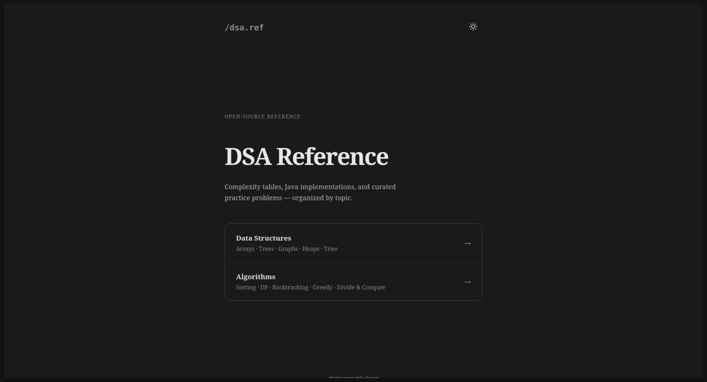

# DSA Reference Cheatsheet

A lightning-fast, zero-dependency web app for quickly looking up Data Structures and Algorithms. This project is built with pure HTML, CSS, and Vanilla JavaScript, ensuring maximum performance and minimum overhead.



## Features

- **Instant Search & Filtering:** Filter algorithms by category (Data Structures, Sorting, Graph, Tree, DP, etc.) or search in real-time.
- **Complexity at a Glance:** Every card shows the exact Time & Space complexities for core operations.
- **Use Cases:** Discover exactly _when_ and _where_ to use an algorithm with common problem patterns.
- **Practice Integration:** Click any use case or the "Get practice problems" button to instantly search for related problems on LeetCode.

## Project Structure

```text
├── index.html              # Landing page (hero- prefix)
├── data-structures.html    # Data Structures reference (ds- prefix)
├── algorithms.html         # Algorithms reference (algo- prefix)
├── styles.css              # Global design tokens and prefixed layouts
├── script.js               # Shared logic (Search, Theme, UI Toggles)
├── data.json               # Database for Data Structures
├── algorithms-data.json    # Database for Algorithms
└── logo.svg                # Favicon
```
## License

This project is licensed under the [MIT License](LICENSE). Feel free to fork, modify, and use this for your own studying or interview prep!
